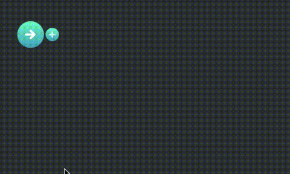

# construct
A graphical interface for designing Deep Learning models in Keras. The web app outputs Python code for use in your project.

A demo can be found <a href="https://tylerpharand.github.io/construct/index.html"><b>here</b></a>

Preview:

